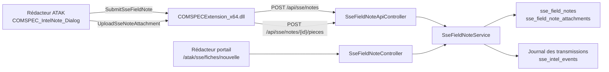

# Fiches de renseignement — API et pont ATAK

## Chaîne complète



L'ordre est imposé : **la fiche d'abord**, elle rend son identifiant ; **les
pièces ensuite**, une par requête. C'est aussi pour cela que les captures d'écran
ne sont prises qu'après la fermeture du rédacteur — prises avant, elles ne
montreraient que l'interface.

## Authentification

Comme le reste des canaux terrain : clé d'accès communautaire
(`ComspecApiKeyAuth`) plus identité Steam vérifiée (`AtakArmaWriteGuard`) sur les
écritures. Les lectures acceptent aussi une session navigateur habilitée.

## `GET /api/sse/notes/catalogue`

Référentiel des libellés, pour que le client affiche exactement les mêmes
intitulés que le portail.

```json
{
  "body_max_length": 1000,
  "attachments_max": 4,
  "themes_max": 4,
  "kinds": [{ "code": "FRM", "label": "Fiche de renseignement de mission", "hint": "…" }],
  "themes": [{ "code": "TERROR", "label": "Terrorisme", "tone": "critical", "color": "#dc2626", "hint": "…" }],
  "urgencies": [{ "code": "routine", "label": "Routine", "hint": "…" }],
  "sources": [{ "code": "HUMINT", "label": "Renseignement humain", "hint": "…" }]
}
```

## `POST /api/sse/notes`

Corps JSON. Seuls `body` et `themes` sont obligatoires.

| Champ | Type | Rôle |
|---|---|---|
| `body` | chaîne | Le renseignement. Tronqué à 1000 caractères. |
| `themes` | liste | Codes de thème (`TERROR`, `MOUV`, …). Les codes inconnus sont ignorés, la liste est plafonnée à 4. |
| `title` | chaîne | Objet, 180 caractères. Facultatif. |
| `note_kind` | chaîne | `FRM` par défaut. |
| `urgency` | chaîne | `routine` par défaut (`critique`, `urgent`, `normal`, `routine`). |
| `intel_source` | chaîne | Discipline de recueil (`HUMINT`, `IMINT`, …). Facultatif. |
| `observed_at` | chaîne | Date du constat. À défaut, l'instant de réception. |
| `place_label` | chaîne | Lieu en clair. |
| `grid_reference` | chaîne | Carroyage. |
| `pos_x`, `pos_y`, `pos_z` | nombre | Position jeu. |
| `lat`, `lng` | nombre | Coordonnées géographiques, si connues. |
| `author_label`, `author_unit`, `author_steam_id` | chaîne | Auteur. Le garde terrain a le dernier mot sur l'identité Steam. |
| `case_code` | chaîne | Référence de dossier. Résolue côté serveur ; inconnue, elle est simplement ignorée. |
| `idempotency_key` | chaîne | Voir ci-dessous. |
| `origin` | chaîne | `atak` par défaut, `arma` accepté. |

Réponses :

- `201` — fiche créée : `{ "ok": true, "created": true, "id": 42, "reference_code": "FR-2026-000042", "note": { … } }`
- `200` — clé d'idempotence déjà vue : `created: false`, la fiche existante est renvoyée
- `422` — `body_required` ou `theme_required`
- `401` / `403` — authentification terrain ou communauté non identifiée
- `503` — `maintenance` (renseignement suspendu par le commandement)

### Idempotence

`idempotency_key` est unique par communauté. Le rédacteur ATAK en génère une par
fiche (`fiche-<steam>-<tick>`) et la garde jusqu'à transmission réussie. Une
double validation, ou une retransmission après coupure de liaison, retombe donc
sur la même fiche au lieu d'en créer une seconde — le cas que l'automatisme de
détection de doublons signalerait ensuite au bureau.

## `POST /api/sse/notes/{id}/pieces`

Envoi multipart. Le fichier est accepté sous `piece`, `image`, `photo` ou `file`.

Champs de formulaire complémentaires : `kind` (`photo`, `capture`, `document`,
`croquis`), `caption`, `grid_reference`, `pos_x`, `pos_y`, `pos_z`, `author`.

Formats acceptés : images JPEG, PNG, WebP, GIF (compressées au-delà de 5 Mo),
documents PDF et texte jusqu'à 8 Mo. Au-delà de quatre pièces, la requête est
refusée en `422` avec un message lisible par l'opérateur.

Les fichiers sont stockés sous `public/uploads/sse/fiches/`.

## `GET /api/sse/notes` et `GET /api/sse/notes/{id}`

Relecture. `steam_uid` filtre sur l'auteur — c'est ainsi que l'ATAK affiche
« mes fiches ». `GET /api/sse/notes/{id}` renvoie la fiche avec ses pièces
jointes.

> Le segment `catalogue` est déclaré **avant** `/{id}` dans `routes/web.php`.
> Déclaré après, le routeur le lirait comme un identifiant et répondrait
> « fiche introuvable ».

## Commandes du pont natif

| Commande `callExtension` | Adresse appelée | Retour |
|---|---|---|
| `SubmitSseFieldNote` | `POST /api/sse/notes` | `["OK", "<id>|<référence>"]` |
| `UploadSseNoteAttachment` | `POST /api/sse/notes/{id}/pieces` | `OK|queued` ou `ERR|…` |

`SubmitSseFieldNote` renvoie l'identifiant **et** la référence dans un seul
champ : le SQF garde l'identifiant pour enchaîner sur les pièces jointes, et
affiche la référence à l'opérateur.

Arguments de `UploadSseNoteAttachment`, dans l'ordre :
`[noteId, cheminOuMotif, auteur, nature, posX, posY, posZ, légende, repère]`.
Un chemin vide déclenche la résolution de la capture la plus récente.

## Fonctions SQF

Addon `connect` — rédacteur :

| Fonction | Rôle |
|---|---|
| `intelNoteCatalog` | Référentiel embarqué (copie du référentiel serveur) |
| `intelNoteCache` | Mémoire des champs — voir ci-dessous |
| `intelNoteShow` | Ouvre le rédacteur en enfant de `cTab_Android_dlg` |
| `intelNoteOnLoad` / `intelNoteOnUnload` | Préparation et nettoyage |
| `intelNotePane` | Bascule rédaction / pièces jointes / contexte |
| `intelNoteRefresh` | Bandeau, pastilles, compteur, emplacements |
| `intelNoteToggleTheme` | Retient ou retire un thème |
| `intelNoteAddPiece` / `intelNoteDropPiece` | Gestion des pièces retenues |
| `intelNoteSaveDraft` | Brouillon dans le profil du joueur |
| `intelNoteSubmit` | Transmission de la fiche puis des pièces |
| `intelNoteClose` | Fermeture en conservant le brouillon |

Addon `atak_athena` — menu dédié :

| Fonction | Rôle |
|---|---|
| `athena_noteOnOpened` | Ouverture du menu **RENS** : ouvre aussitôt le rédacteur plein cadre |
| `athena_updateNote` | Page d'accueil du menu : liaison, brouillon, repère |
| `athena_openNote` | Point d'entrée commun (menu, icône Desktop, action ACE) |

Le menu est déclaré **deux fois** dans `atak_athena/config.cpp` : sous
`ATAK_APPs`, que lit BCE, et sous `RscTitles >> ATAK_APPs`. Une seule des deux
déclarations et le menu n'apparaît pas dans le tiroir.

## Pourquoi une mémoire des champs

Les trois volets du rédacteur partagent un seul dialog : les champs du volet
inactif sont masqués (`ctrlShow false`). Or un `RscEdit` masqué peut renvoyer une
chaîne vide — le terminal SEEK a déjà rencontré ce piège. Une fiche validée
depuis le cadre de rédaction serait donc partie sans son lieu, son repère ni son
code dossier, tous logés dans le volet contexte.

`intelNoteCache` recopie chaque valeur tant qu'elle est lisible et sert de repli
à la lecture :

- `["capture"]` — appelé avant chaque bascule de volet et à la fermeture ;
- `["restore"]` — réinjecte la mémoire dans les champs redevenus visibles ;
- `["value", clé]` — lecture ; un champ **visible fait foi même vidé**, sinon
  effacer le cadre de rédaction laisserait le compteur figé sur l'ancienne
  longueur ;
- `["clear"]` — au chargement, pour qu'une fiche n'hérite pas de la précédente.

Clés disponibles : `body`, `date`, `place`, `grid`, `case`. Les listes
déroulantes ne passent pas par là : `lbCurSel` reste fiable sur un contrôle
masqué.
