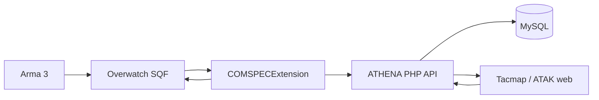
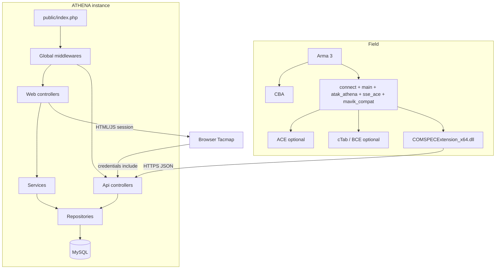
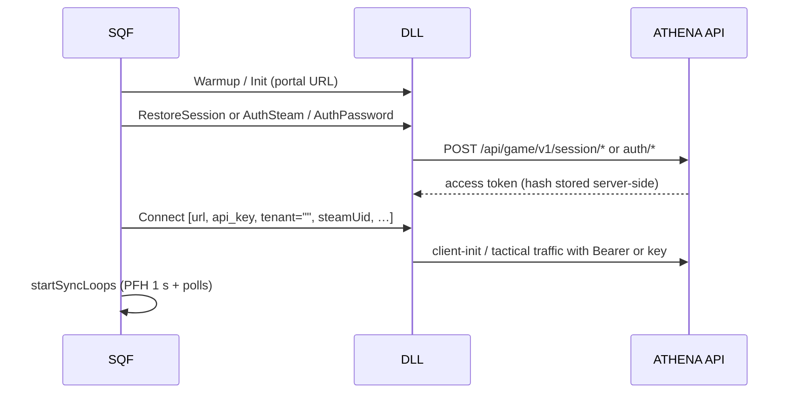
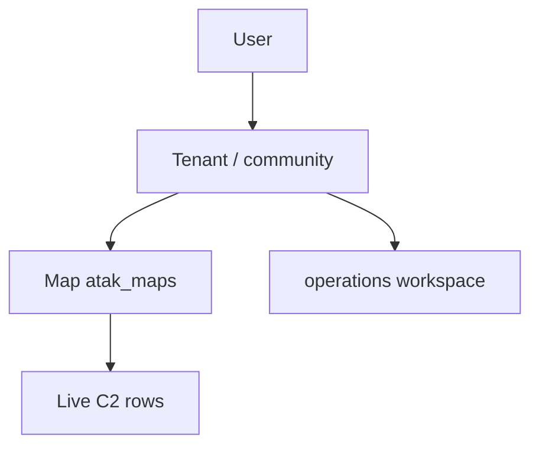
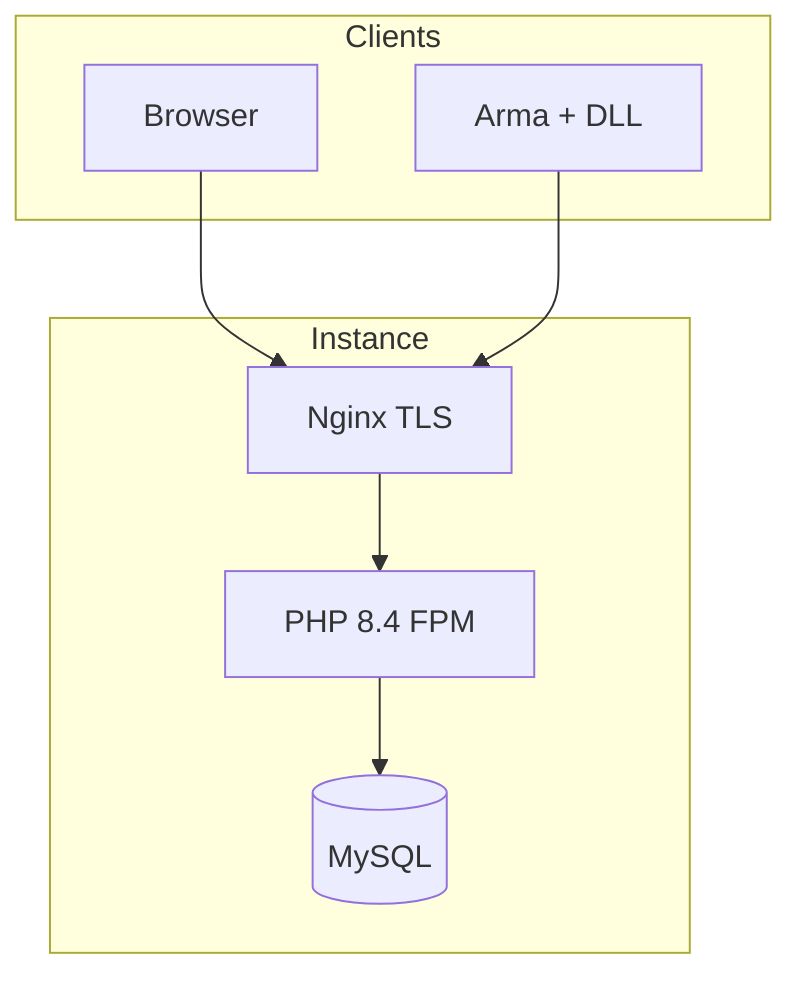

ATHENA C2
TECHNICAL PUBLICATION

Document: ATHENA C2 — System Architecture
Reference: ATP-A3-01
Revision: 1.0
Status: CONTROLLED
Classification: INTERNAL
Authority: COMSPEC
System: ATHENA C2

| Field           | Value          |
| --------------- | -------------- |
| Document ID     | ATP-A3-01      |
| Revision        | 1.0            |
| Status          | CONTROLLED     |
| Owner           | COMSPEC        |
| System          | ATHENA C2      |
| Last Review     | 2026-09-02     |
| Source of Truth | Git repository |

## Revision History

| Revision | Date       | Author  | Changes                        |
| -------- | ---------- | ------- | ------------------------------ |
| 1.0      | 2026-09-02 | COMSPEC | Initial controlled publication |

---

# ATHENA C2 — System Architecture

## 1. Purpose

This publication is the global architecture reference for ATHENA C2 as **implemented** in this repository. Interface payloads are in ICD-A3-01. Addon internals are in TM-A3-11. Security is in SEC-A3-01.

## 2. End-to-end chain (as coded)

```text
ARMA 3
    │
    │ SQF (COMSPEC Overwatch addons)
    ▼
COMSPEC OVERWATCH
    │
    │ callExtension "COMSPECExtension"
    ▼
COMSPECExtension_x64.dll  (Native AOT, .NET 8)
    │
    │ HTTP JSON (polling, no Socket.IO)
    ▼
ATHENA C2 BACKEND  (PHP monolith)
    ├── Authentication (session / game tokens / tactical key)
    ├── Tenant context
    ├── Map context (default map_id = 1)
    ├── Operations workspace (web planning)
    ├── PLI / BFT, Intel, Markers, Chat, C2 services
    └── MySQL
    │
    ▼
ATAK / TACMAP WEB  (Leaflet CRS Simple + mobile shell)
```

Live C2 is **PHP polling**, not a Node/Socket.IO bus. `NODE_ATAK_URL` may point at an optional companion; it is not required for the fielded chain (REG-A3-01 CAP-NOD-001 UNVERIFIED).



## 3. Component diagram



### Responsibilities

| Component | Responsibility | Boundary |
| --------- | -------------- | -------- |
| Overwatch SQF | Locality client, ACE, polls, payload assembly | Does not HTTP itself |
| Extension | Auth HTTP, POST/GET, queues, backoff | Trusts `_baseUrl` + tokens; does not pick tenant |
| PHP `AtakApiController` | Live C2 CRUD | Requires tenant; default map 1 |
| `GameAuthApiController` | Game session | Opaque tokens in `game_sessions` |
| `AtakController` | Tacmap page + feature gate `atak` | Web only |
| `OperationWorkspaceController` | Planning workspace | Not Overwatch mapId |
| Tacmap JS | Poll 4–12 s, CRS Simple | Session cookie |

## 4. PHP application architecture

Monolith: document root `public/`, routes `routes/web.php`, PSR-4 `App\`.

Global middleware order (outermost last in `Application::run`): RateLimit, AntiScraper, SecurityHeaders, **ComspecTacticalApiMiddleware**.

Layers: Controllers → Services → Repositories → SQL (parameterised).

Implementation references:

- `app/Core/Application.php`
- `routes/web.php`
- `app/Controllers/Api/AtakApiController.php`
- `app/Repositories/AtakDataRepository.php`
- `app/Support/ComspecApiKeyAuth.php`
- `docs/technique/architecture.md` (companion)

## 5. Data flow — connection



Community is applied from the matched key or `game_sessions.tenant_id`, not from a player-typed tenant id.

## 6. Data flow — PLI

```mermaid
sequenceDiagram
    participant PFH as SQF PFH 1s
    participant UP as fn_updatePosition
    participant DLL
    participant API as POST /api/atak/position
    participant DB as atak_units
    participant WEB as Tacmap poll GET /api/atak/units
    PFH->>UP: player
    UP->>DLL: UpdatePosition args 0..13
    DLL->>API: JSON mapId 1, call_sign, pos_x/y, extra
    API->>DB: upsert tenant+map+callsign
    WEB->>API: GET units
    API-->>WEB: rows; stale if age > 120 s
```

Send interval inside `updatePosition` is further gated by CBA network profile (default position slider 5 s, heartbeat 30 s).

## 7. Data flow — Intel / chat / markers

Same pattern: SQF → named extension command → HTTP → table keyed by tenant_id + map_id → web poll. Reverse: DLL GET cache → SQF poll (`GetChatMessages` ~6 s, `GetMarkers` ~8 s, `GetMapShapes` ~10 s).

## 8. Mission / workspace context



| Context | Resolved by | Used for |
| ------- | ----------- | -------- |
| Tenant | Key / game session / PHP session / query / body / env default | All live tables |
| Map | `mapId` / `map_id` query; **default 1** | Units, markers, chat |
| Operation | UUID on `/operations` | Planning, overlays, mission plan PDF |

Overwatch does not select `workspace_key`.

## 9. Coordinates

| Layer | Format |
| ----- | ------ |
| Arma | World metres `[x,y]` / `[x,y,z]`; Z from `getPosASL` |
| DLL | `pos_x`, `pos_y`, optional `pos_z` / `asl_z` |
| DB | `pos_x`, `pos_y` (floats); Z in extra JSON |
| Tacmap | Leaflet CRS Simple; same metres. `WORLD_SCALE` used in JS as a world size constant (e.g. 30000) |

No WGS84 conversion is applied. Grid strings may be approximated to world via `AtakDataRepository::parseGridRef`.

## 10. Storage

Principal live tables (see `migrations/schema.sql` and feature bootstraps): `atak_units`, `atak_markers`, `atak_chat_messages`, `atak_pings`, `atak_intel_photos`, `atak_nine_line`, `atak_orders`, `atak_laser_codes`, `atak_air_assets`, `atak_map_shapes`, waypoints, zones, vehicles, geo, scene, terrain, `game_sessions`, `operations`, `tenant_atak_config`.

Session notepad/SOI: JSON files `storage/cache/atak-session/t{tenant}_m{map}.json` (not SQL).

Legacy `atak_intel`: **no tenant_id** — do not use for new traffic.

## 11. Synchronisation

| Path | Mechanism |
| ---- | --------- |
| Field → server | HTTP POST, in-memory queue, 429/network backoff |
| Server → field | HTTP GET, DLL poll cache (avoid hitching the game thread) |
| Server → web | JS polling (units ~8 s default on operational map) |
| Push sockets | Not fielded |

## 12. Multi-tenant

See SEC-A3-01. Almost all live C2 rows include `tenant_id`. Inter-tenant map share uses `atak_map_gateways` (opt-in).

## 13. External interfaces

| Interface | Notes |
| --------- | ----- |
| Steam Web API | Game auth |
| Mail | OTP, alerts |
| PayPal / Stripe | Plan feature `atak` |
| SSE APIs | Adjacent product |
| Optional Node | `NODE_ATAK_URL` |

## 14. Deployment view



CI: `.github/workflows/ci.yml` (PHPUnit, PHPStan). Deploy: `.github/workflows/deploy-vps.yml` SSH fast-forward on `main`. Details: ATP-A3-11.

## 15. Trust boundaries

See SEC-A3-01. Summary: Browser session ≠ game Bearer ≠ community access key. The DLL is a trusted client only insofar as it holds a secret issued by ATHENA.

## References

- ATHENA C2 Field Manual — FM-A3-01
- COMSPEC Overwatch Technical Manual — TM-A3-11
- ATHENA–ATAK Interface Control Document — ICD-A3-01
- ATHENA C2 Security Architecture — SEC-A3-01
- ATHENA C2 Deployment and Release Manual — ATP-A3-11
- ATHENA C2 Capability Registry — REG-A3-01
