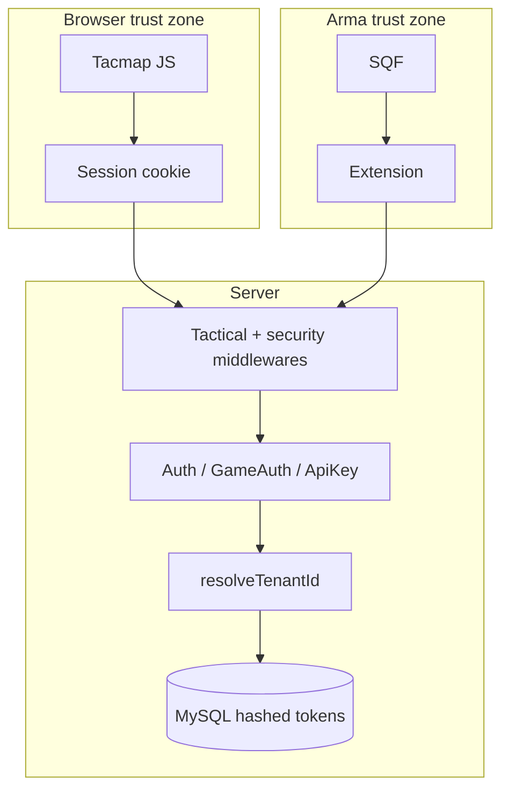

ATHENA C2
TECHNICAL PUBLICATION

Document: ATHENA C2 — Security Architecture
Reference: SEC-A3-01
Revision: 1.0
Status: CONTROLLED
Classification: INTERNAL
Authority: COMSPEC
System: ATHENA C2

| Field           | Value          |
| --------------- | -------------- |
| Document ID     | SEC-A3-01      |
| Revision        | 1.0            |
| Status          | CONTROLLED     |
| Owner           | COMSPEC        |
| System          | ATHENA C2      |
| Last Review     | 2026-09-02     |
| Source of Truth | Git repository |

## Revision History

| Revision | Date       | Author  | Changes                        |
| -------- | ---------- | ------- | ------------------------------ |
| 1.0      | 2026-09-02 | COMSPEC | Initial controlled publication |

---

# ATHENA C2 — Security Architecture

This publication records **implemented** controls. Missing controls are marked **SECURITY GAP**. Companion: `docs/technique/securite-et-permissions.md`.

---

## 1. Trust boundaries

```text
Browser
↓
Web Session (PHP)
↓
ATHENA Backend
↓
Database

Arma
↓
COMSPEC DLL
↓
ATAK / tactical API
↓
Tenant Resolver
↓
Mission / map context
```



The three client identities must not be conflated:

1. Logged-in member (session `user_id` + `tenant_id`)
2. Game session (Bearer / `X-ATAK-TOKEN` matching `game_sessions.access_token_hash`)
3. Community or platform access key (`X-COMSPEC-KEY` / body `api_key`)

---

## 2. Authentication

### 2.1 Web session

- `AuthService` + PHP sessions; Argon2id passwords.
- Cookie: HttpOnly, SameSite=Lax, Secure in production.
- `AuthMiddleware` reloads RBAC; rejects inactive/locked users and tenant mismatch.

### 2.2 HMAC “ATAK token”

- `AtakTokenService::generate`: `base64(json).base64url(HMAC-SHA256)`.
- Claims: `sub`, `tenant_id`, `display_name`, `callsign`, `iat`, `exp` (3600 s).
- Secret: `tenant_atak_config.jwt_secret` or `JWT_SECRET`.
- Injected as `window.ATAK_TOKEN` on the Tacmap page.
- **SECURITY GAP:** no PHP verifier for this token was found. Browser API auth is the **session**. Env comments `JWT_ISSUER` / `JWT_AUDIENCE` are unused.

### 2.3 Game tokens

- Opaque 32-byte hex; **SHA-256 stored**.
- Access 7200 s, refresh ~30 days, OTP 600 s.
- Paths: password, OTP, Steam challenge/exchange, restore/refresh.

### 2.4 Tactical API

`ComspecApiKeyAuth::enforceForTacticalPath()` on `/api/atak*` and other tactical prefixes (`config/tactical_api.php`).

Enforced when `APP_ENV` is production **or** `TACTICAL_API_STRICT=true`. Otherwise the API may be open if no platform key is configured — **SECURITY GAP** on non-prod instances.

Exempt examples: `/api/atak/ping`, `whoami`, beta-register, some game-link and QR routes.

Session / phone-pairing may satisfy tactical auth when `TACTICAL_API_ALLOW_SESSION` is not disabled (default allow).

---

## 3. Tenant context resolution

**Prohibited:** implicit `tenant_id = 1` as a silent fallback.

`AtakApiController::resolveTenantId` order:

1. `ComspecApiKeyAuth::matchedTenantId()` (community key or game session)
2. Session `tenant_id`
3. Query `tenant_id`
4. JSON body `tenant_id`
5. Query `tenant_slug`
6. Env `ATAK_DEFAULT_TENANT_ID` or `APP_ATAK_DEFAULT_TENANT_ID`
7. Else `null` → **403** `tenant_context_required`

`requireTenant` then applies community ATAK maintenance (503).

**SECURITY GAP:** after a session or unmatched platform key, client-supplied `tenant_id` / `tenant_slug` can still select a tenant. Isolation then depends on whether writes are further bound to the authenticated principal (`guardArmaWrite`). Historical audit: `docs/AUDIT-TENANT-FILTRAGE.md`. Treat client-supplied tenant as a residual IDOR / cross-tenant risk until every write path is proven bound.

`map_id` **does** default to **1**. That is a map default, not a tenant default.

CBA `comspec_overwatch_tenant_id` is not authority. Bootstrap clears it as authority.

---

## 4. RBAC and route control

| Layer | Mechanism |
| ----- | --------- |
| Site | `SystemAdminMiddleware` / `admin.system` |
| Community | `OrganizationAdminMiddleware` / `admin.organization` … |
| Intra | `RbacService` + `Gate` permission slugs |
| ATAK web | `FeatureGateService::allows($tenantId, 'atak')` |
| ATAK API | Tactical key/session — **not** the plan feature gate (**SECURITY GAP** if billing is assumed to lock the API) |
| Sanctions | `AtakModuleSanctionMiddleware` restriction `atak` |

Platform-reserved slugs cannot be granted on tenant roles.

---

## 5. Headless API

Tactical routes return JSON. Uncaught errors: `TacticalApiErrorRenderer` → `{ok:false, message}` HTTP 503, `Retry-After: 30`. Clients must not receive stack traces (`APP_DEBUG` off in production).

---

## 6. Secrets and configuration

| Secret | Store | Note |
| ------ | ----- | ---- |
| `JWT_SECRET` | `.env` | Empty → hardcoded `'athena-secret-change-me'` **SECURITY GAP** |
| Tenant jwt_secret | DB | Per community |
| `X_COMSPEC_KEY` | `.env` | Platform |
| Community access_key | DB | Rotate in admin UI |
| Game tokens | DB hashes only | |
| Stripe/PayPal | `.env` | |
| `CRON_SECRET` | `.env` | |

`.env` is not committed. Deploy workflow does not pull `.env` from git.

---

## 7. Payload validation and SQL

Repositories use bound parameters. Positions pass `assertPositionCoords`. Floats accept locale commas. Extension drops `(0,0)` poses. This is not a full JSON schema validator — **SECURITY GAP** for arbitrary `extra` / `markerData` size and content.

---

## 8. Logs and audit

- `AppLog` → `storage/logs/app.log`
- `ERROR_ALERT_*` mail + `error-alerts.log`
- `audit_logs` via `AuditService` (auth, tenant, config updates, …)
- ATAK activity: `AtakActivityLogService`
- Extension: RPT + optional `LogWrite` file; `ReportDiag`

Do not log raw access tokens or JWT secrets.

---

## 9. Administrative permissions

System admin: `/admin/system/*` including deployment campaigns. Community admin: `/back-office/*` including ATAK config. Operators: no admin surfaces.

---

## 10. Risk register (C2)

| Risk | Control present? | Notes |
| ---- | ---------------- | ----- |
| IDOR on C2 rows | Partial | Queries scoped by resolved tenant; client tenant override is a residual |
| Cross-tenant access | Partial | Live tables keyed; legacy `atak_intel` **not** keyed **SECURITY GAP** |
| JWT leakage | Partial | Token in page JS; 1 h life; session is real web auth |
| Configuration compromise | Operational | `.env` on VPS; empty JWT_SECRET fallback |
| DLL spoofing | Weak | Anyone with URL+key can POST; no code signing check documented in PHP **SECURITY GAP** |
| Replay | Partial | Game tokens hashed; HMAC token has `exp`; no jti store |
| Payload tampering | Partial | HTTPS expected; extra JSON merged |
| Secret exposure | Operational | Keys in CBA screenshots; Steam UID in payloads |
| Feature-gate bypass | **SECURITY GAP** | API without `allows('atak')` |
| Open tactical API in non-prod | **SECURITY GAP** unless `TACTICAL_API_STRICT` |

---

## Implementation References

- `app/Controllers/Api/AtakApiController.php` (`resolveTenantId`)
- `app/Support/ComspecApiKeyAuth.php`
- `app/Services/Tactical/AtakTokenService.php`
- `app/Services/Game/GameAuthService.php`
- `app/Services/Platform/FeatureGateService.php`
- `config/tactical_api.php`
- `app/Middleware/ComspecTacticalApiMiddleware.php`

## References

- ATHENA C2 System Architecture — ATP-A3-01
- ATHENA–ATAK Interface Control Document — ICD-A3-01
- ATHENA C2 Administrator Manual — TM-A3-31
- ATHENA C2 Capability Registry — REG-A3-01
