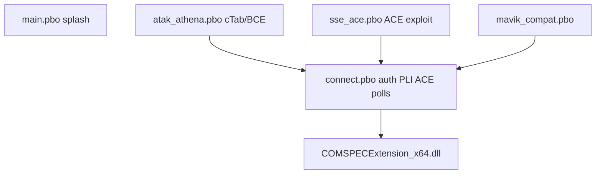

ATHENA C2
TECHNICAL PUBLICATION

Document: COMSPEC Overwatch — Technical Manual
Reference: TM-A3-11
Revision: 1.0
Status: CONTROLLED
Classification: INTERNAL
Authority: COMSPEC
System: ATHENA C2

| Field           | Value          |
| --------------- | -------------- |
| Document ID     | TM-A3-11       |
| Revision        | 1.0            |
| Status          | CONTROLLED     |
| Owner           | COMSPEC        |
| System          | ATHENA C2      |
| Last Review     | 2026-09-02     |
| Source of Truth | Git repository |

## Revision History

| Revision | Date       | Author  | Changes                        |
| -------- | ---------- | ------- | ------------------------------ |
| 1.0      | 2026-09-02 | COMSPEC | Initial controlled publication |

---

# COMSPEC Overwatch — Technical Manual

This manual describes the Arma 3 pack and native extension **as sourced** under `mod/UptoDate/`. Payloads and HTTP contracts: ICD-A3-01.

The connect addon registers **hundreds** of `fn_*.sqf` files (`CfgFunctions` in `connect/config.cpp`). This publication gives full sheets for the interface-critical functions and an inventory by class. A one-line dump of every file is not a substitute for reading the source.

## Version note

| Component | Source of truth | Observed |
| --------- | --------------- | -------- |
| connect | `versionStr` in `connect/config.cpp` | **1.5.13** |
| atak_athena | `atak_athena/config.cpp` | **1.0.76** |
| sse_ace | `sse_ace/config.cpp` | **1.4.17** |
| main / mavik_compat | respective `config.cpp` | **1.4.8** |
| Extension | `Extension.cs` `ExtensionVersion` | **1.18.6** |
| Packaged CHANGELOG header | `@COMSPECOverwatch/CHANGELOG.md` | 1.5.12 / liaison 1.18.6 (header lag vs connect 1.5.13) |
| csproj `<Version>` | `COMSPECExtension.csproj` | **1.18.1** (stale vs const) |

Portal copy `docs/technique/overwatch-mod/` may still stamp 1.4.11 — not authoritative.

---

## 1. Architecture

```text
Arma Script
   │
   ▼
SQF Function  (tag comspec_overwatch_connect_fnc_*)
   │
   ▼
callExtension ["COMSPECExtension", [command, args]]
   │
   ▼
COMSPECExtension_x64.dll
   │
   ▼
ATHENA API
```



PBO prefix: `z\comspec_overwatch\addons\{main|connect|atak_athena|sse_ace|mavik_compat}`.

### CfgPatches / requiredAddons

| Patch | requiredAddons |
| ----- | -------------- |
| `comspec_overwatch_main` | `cba_main`, `cba_xeh`, `A3_UI_F` |
| `comspec_overwatch_connect` | `comspec_overwatch_main`, `cba_main`, `cba_xeh`, `cba_settings`, `A3_Modules_F` |
| `comspec_overwatch_atak_athena` | `cba_main`, `cba_xeh`, `cTab`, `ctab_core`, `BCE_Core`, `BCE_cTab_ATAK`, `comspec_overwatch_connect` |
| `comspec_overwatch_sse_ace` | `comspec_overwatch_connect`, `cba_main`, `cba_xeh`, `cba_settings` (ACE soft) |
| `comspec_overwatch_mavik_compat` | `cba_main`, `cba_settings`, `cba_xeh`, `Mavic_Core` |

cTab/BCE/ACE/Mavic are **soft** at runtime when the patch cannot load.

### Namespaces

| Tag | Functions |
| --- | --------- |
| `comspec_overwatch_connect` | `comspec_overwatch_connect_fnc_*` |
| `comspec_overwatch_atak_athena` | `comspec_overwatch_atak_athena_fnc_*` |
| `comspec_overwatch_sse_ace` | `comspec_overwatch_sse_ace_fnc_*` |
| `mavik_compat` | overrides `Mavic_fnc_handleConnect` |

### XEH

| Addon | PreInit | PostInit |
| ----- | ------- | -------- |
| connect | CBA settings + keybinds | server+client; client defers `initATAK` |
| atak_athena | preInit | postInitClient |
| sse_ace | preInit | postInitClient |
| mavik_compat | preInit | — |
| main | DisplayLoad splash | — |

---

## 2. Lifecycle

1. **preInit** — CBA settings.
2. **postInit** — `Warmup`; optional session log; marker EHs.
3. **initAuth** — `Init` portal URL → `RestoreSession` or `AuthSteam` in mission.
4. **applyBootstrap** — `COMSPEC_AthenaReady`, callsign, tenant name; CBA tenant id not authority.
5. **connect** — `Ping` then `Connect [url, api_key, tenant="", steamUid, modVersion, bloodType]`.
6. **waitAthenaReady** → **startSyncLoops** — PFH 1 s position + chat/markers/orders/CAS polls.
7. **disconnect** — `Disconnect`; `COMSPEC_DisconnectSent` stops PLI.

There is **no** workspace / mission picker. `mapId` in DLL JSON is **1**.

---

## 3. CBA settings (connect `XEH_preInit.sqf`)

`comspec_overwatch_enabled`, `comspec_overwatch_api_url`, `comspec_overwatch_api_key`, `comspec_overwatch_tenant_id` (not authority), `comspec_overwatch_update_interval`, `comspec_overwatch_network_authority`, `comspec_overwatch_network_profile_server`, `comspec_overwatch_network_profile`, `comspec_overwatch_network_policy`, `comspec_overwatch_heartbeat_interval`, `comspec_overwatch_position_interval`, `comspec_overwatch_batch_interval`, `comspec_overwatch_position_threshold`, `comspec_overwatch_terminal_mode`, `comspec_overwatch_playtime_enabled`, `comspec_overwatch_playtime_report_interval`, `comspec_overwatch_vehicle_mode`, `comspec_overwatch_sync_map_markers`, `comspec_overwatch_profile_enabled`, sound/notif keys, `comspec_overwatch_webbrowser_enabled`, `comspec_overwatch_require_item`, `comspec_overwatch_required_item`, `comspec_overwatch_ace_menus`, `comspec_overwatch_log_level`, `comspec_overwatch_log_to_file`, radio proximity keys, OPFOR/INDFOR/CIV display, FRS UI, roleplay/realism, `comspec_overwatch_order_compose_enabled`.

Default API URL fallback in `fn_connect`: `https://athena.ttrd.fr/public`.

---

## 4. Extension

- Name: **`COMSPECExtension`**
- Project: `mod/UptoDate/COMSPECExtension/Extension.cs`, `GameAuth.cs`
- HTTP: `HttpClient`, headers via `AttachApiKeyHeader` (Bearer game token and/or key)
- Queue: `ConcurrentQueue` `PendingPosts` max **500**; positions **coalesced** (last wins); drain timer; 429 and network backoff ladders
- Not disk-persistent (REG-A3-01 CAP-Q-002 PLANNED)
- GET poll cache (`PollGetSlot`) so the game thread does not wait HTTP

### Commands called from SQF (observed)

Warmup, Init, Ping, GetVersion, GetExtensionVersion, Connect, Disconnect, GetClientIp, AuthSteam, AuthPassword, VerifyOtp, RestoreSession, GetAuthState, SyncProfile, Logout, LinkBySteam, RedeemGameLink, RegisterBeta, UpdatePosition, UpdateVehicleTracking, ReportPlaytime, CheckZonePosition, SendChat, SendPing, UploadImage, SendMarker, GetChatMessages, GetMarkers, GetMapShapes, Intel.Report, SubmitTacticalReport, CreatePOI, GetCASForCallsign, SendCASAck, SendCASState, SendCASCheckLine, PilotResponse, SendFlightManifest, SyncLaserCode, FireSupport.Request, GetOrders, UpdateOrderStatus, GetWaypoints, MarkWaypointReached, GetAiOrders, GetTacticalZones, GetTacticalAlerts, GetMissionPlan, GetExplosiveCommands, SubmitExplosiveTimer, GetMedicalAlerts, TriageMedicalAlert, RequestMEDEVAC, RequestQRF, StageCapture, NotifyNewPhoto, wardrobe/briefing/experience/mod-modules, Terrain.Chunk, Scene.Ingest, Geo.Ingest, Theater.Coverage, Logistics.Update, IFF.*, SendWeather, SendVideoFeeds, SSE submits, LogWrite, GetLogTail, GetLastPostError, ReportDiag.

DLL also defines commands with little/no SQF call found (e.g. `SendDesignator`, `SendSigint`, `GetBootstrap`) — treat SQF coverage as UNVERIFIED per command.

---

## 5. Function sheets (critical)

### 5.1 `comspec_overwatch_connect_fnc_connect`

| Field | Value |
| ----- | ----- |
| Function | `comspec_overwatch_connect_fnc_connect` |
| Purpose | Resolve URL/key, Ping extension, Connect, set link state |
| Execution locality | Client (`hasInterface`) |
| Parameters | None (reads CBA / profileNamespace) |
| Return value | Nil / early exit |
| Side effects | `COMSPEC_LinkState`, `COMSPEC_LinkDetail`, `COMSPEC_AthenaLinkChanged` |
| Dependencies | Extension loaded; CBA settings |
| DLL command used | `Ping`, `Connect`, `GetClientIp` |
| API interaction | Via Connect (client-init / auth already done) |
| Error behaviour | Invalid URL/key → offline; logs link journal |
| Called by | Auth success, account link, manual reconnect |

Implementation: `mod/UptoDate/Sources/comspec-overwatch-addons/connect/functions/fn_connect.sqf`

### 5.2 `comspec_overwatch_connect_fnc_updatePosition`

| Field | Value |
| ----- | ----- |
| Function | `comspec_overwatch_connect_fnc_updatePosition` |
| Purpose | Push player PLI + extra telemetry |
| Execution locality | Client; `_unit` must be `player` |
| Parameters | `_unit`, `_force` (bool, default false) |
| Return value | If `_force`: `"ok"` / `"dead"` / `"origin"` / `""` |
| Side effects | `UpdatePosition`; medical alert check; skip logs |
| Dependencies | `isReady`, terminal or phone-track flag, not in respawn grace, clientState ≥ 10 MP |
| DLL command used | `UpdatePosition` |
| API interaction | `POST /api/atak/position` |
| Error behaviour | Skip on backoff, (0,0), dead, not ready; `_force` bypasses some gates |
| Called by | PFH in `fn_startSyncLoops` (1 s tick; send gated), `fn_forceSyncData` |

Args to extension: X, Y, heading, callsign, role, health, fuel, ammo, radio, vehicle JSON, steam UID, group, ASL Z, mod version.

Implementation: `…/fn_updatePosition.sqf`

### 5.3 `comspec_overwatch_connect_fnc_startSyncLoops`

| Field | Value |
| ----- | ----- |
| Purpose | Start PFH + profile-wrapped polls |
| Locality | Client |
| Parameters | None |
| DLL | Indirect via poll functions |
| Polls (seconds) | Chat ~6, Athena markers ~8, map shapes ~10, tactical alerts ~10, mod modules ~45 |
| Called by | `fn_waitAthenaReady` / ready event |

Implementation: `…/fn_startSyncLoops.sqf`

### 5.4 `comspec_overwatch_connect_fnc_sendIntel`

| Field | Value |
| ----- | ----- |
| Purpose | Dispatch CHAT / PING / PHOTO / default |
| Locality | Client |
| DLL | `SendChat` / `SendPing` / `UploadImage` |
| API | `/api/chat`, `/api/pings`, photo upload |
| Called by | Chat submit, ACE ping, photo paths |

### 5.5 `comspec_overwatch_connect_fnc_queueMapMarker` / `fn_syncMapMarker`

| Field | Value |
| ----- | ----- |
| Purpose | Send Arma marker create/update/delete |
| DLL | `SendMarker` |
| API | `POST /api/atak/marker` |
| Reverse | `fn_pollAthenaMarkers` → `GetMarkers` |

### 5.6 `comspec_overwatch_connect_fnc_submitChat`

| Field | Value |
| ----- | ----- |
| Purpose | Operator chat to C2 journal |
| DLL | via `sendIntel` → `SendChat` |
| API | `POST /api/chat` |

### 5.7 `comspec_overwatch_connect_fnc_requestMEDEVAC`

| Field | Value |
| ----- | ----- |
| Purpose | MEDEVAC 9-line |
| DLL | `RequestMEDEVAC` |
| Locality | Client |

### 5.8 `comspec_overwatch_connect_fnc_submitFlightManifest` / `fn_reportCrewedAirAssets`

| Field | Value |
| ----- | ----- |
| Purpose | Flight manifest / air assets |
| DLL | `SendFlightManifest` |
| API | `POST /api/atak/flight-manifest` |

### 5.9 `comspec_overwatch_connect_fnc_initACE`

| Field | Value |
| ----- | ----- |
| Purpose | ACE_SelfActions tree `COMSPEC_Main` |
| Locality | Client |
| DLL | None directly |
| Side effects | Self-actions: login, ATAK phone, ping, CAS, manifest, recon, … |
| Called by | postInit when ACE present and setting on |

Alternate: `fn_initACEAthena.sqf` slim menu.

### 5.10 Auth class (`connect/functions/auth/`)

| Function | DLL | Role |
| -------- | --- | ---- |
| `fn_initAuth` | Warmup, Init | Start |
| `fn_loginSteam` | AuthSteam | Steam |
| `fn_submitPassword` | AuthPassword | Password |
| `fn_submitOTP` | VerifyOtp | OTP |
| `fn_restoreSession` | RestoreSession | Saved session |
| `fn_applyBootstrap` | GetAuthState | Profile/tenant |
| `fn_syncProfile` | SyncProfile | Periodic |
| `fn_logout` | Logout | Logout |
| `fn_isReady` | — | Gate sync |

### 5.11 `comspec_overwatch_connect_fnc_extensionCallback`

Handles async DLL: Connected, Error, AccessDenied, RateLimited, RateLimitClear, NetworkHiccup, SendBackoff, BftIdentity, …

---

## 6. Errors and logs

| Mechanism | Role |
| --------- | ---- |
| `fn_log` | RPT + buffer + optional file |
| `fn_callExtLogged` | Wrap extension |
| `fn_extResult` / `fn_parseAtakExtResponse` | `OK|` / `ERR|` |
| `COMSPEC_ApiBackoffUntil` | Pause PLI |
| `GetLastPostError` | Debug overlay |
| `GetLogTail` + `ReportDiag` | Bug report |

---

## 7. ACE / cTab / SSE

- ACE: §5.9
- `atak_athena`: ~99 functions — cTab marker/weather/drone/route/video/photo bridges; ATAK apps (Task, Status, FRS, …)
- `sse_ace`: `fn_initSseAce`, `fn_sseCanExploit`, `fn_sseExploitTargetLabel` — SSE product, not C2 SOP

---

## Implementation References

- `mod/UptoDate/Sources/comspec-overwatch-addons/connect/config.cpp`
- `mod/UptoDate/Sources/comspec-overwatch-addons/connect/XEH_preInit.sqf`
- `mod/UptoDate/Sources/comspec-overwatch-addons/connect/XEH_postInit.sqf`
- `mod/UptoDate/Sources/comspec-overwatch-addons/connect/functions/fn_connect.sqf`
- `mod/UptoDate/Sources/comspec-overwatch-addons/connect/functions/fn_updatePosition.sqf`
- `mod/UptoDate/Sources/comspec-overwatch-addons/connect/functions/fn_startSyncLoops.sqf`
- `mod/UptoDate/COMSPECExtension/Extension.cs`
- `docs/technique/overwatch-mod/architecture.md` (website companion)

## References

- ATHENA C2 System Architecture — ATP-A3-01
- ATHENA–ATAK Interface Control Document — ICD-A3-01
- ATAK Operator Manual — TM-A3-21
- ATHENA C2 Capability Registry — REG-A3-01
